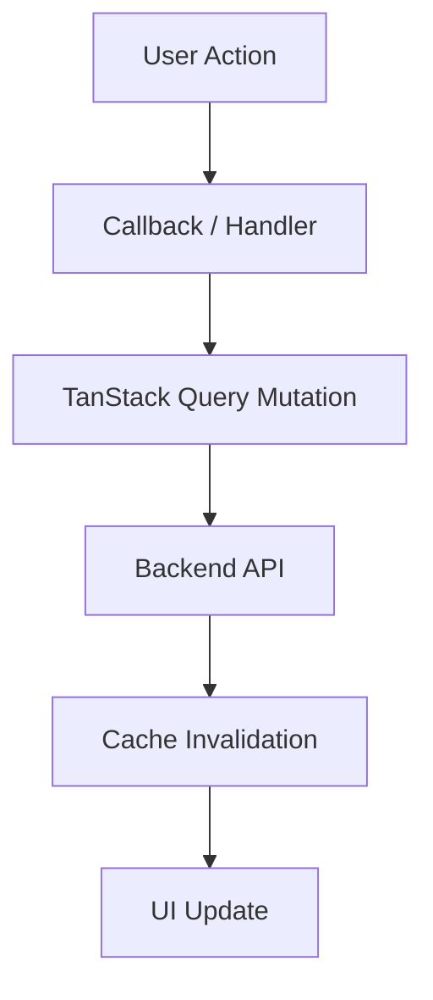

# Architecture

DealScope follows a modular, feature-oriented architecture optimized for scalable Next.js development.

## Folder Structure
```
src/
├── app/              # App Router Pages & Layouts
├── components/       # Feature & Shared Components
│   ├── dashboard/    # Dashboard layout sections
│   ├── product/      # Product detail layout sections
│   ├── comparison/   # Comparison layout sections
│   ├── wishlist/     # Wishlist UI components
│   ├── notifications/# Alerts and feed components
│   └── shared/       # Reusable business components
└── lib/              # Utilities & Shared helpers
```

## Data Flow
Components are strictly separated from business logic. Data fetching is intended to be handled via TanStack Query (in next phase) to ensure optimistic updates and cache management.


